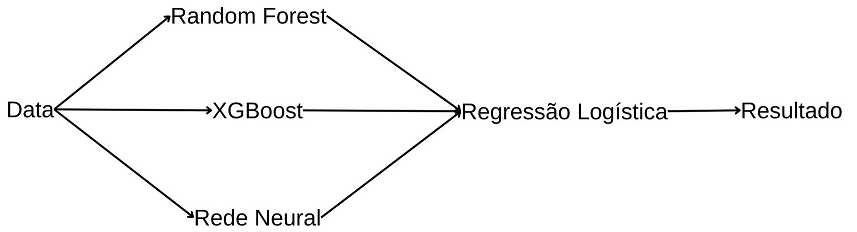

# Descrição
Utilizando machile learning para detectar fraude em vagas de emprego.

Fonte dos dados: https://www.kaggle.com/datasets/amruthjithrajvr/recruitment-scam

# Sobre os dados:
- A base possui variáveis categóricas e textuais, por isso utilizei duas base: uma apenas com as variáveis categóricas e outra com as categóricas e as variáveis criadas com Word2Vec de 300 dimensões.
> Utilizei o W2V criado e treinado pelo Google: https://code.google.com/archive/p/word2vec/
- Como é comum na área de fraude, a base de dados é desbalanceada, possui 4.84% de dados fraudulentos. 

# Modelos:
- Random Forest
- XGBoost
- Rede Neural simples com apenas uma camada
- Ensemble Hard Voting
- Ensemble Soft Voting
- Stacking com Passthrough
- Stacking sem Passthrough

Representação do stacking:

# Resultados:

## Acurácia
### Base sem NLP
| Modelo | Treino | Teste |
| ------------- | ------------- | ------------- |
| Random Forest | 99.43 | 98.15 |
| XGBoost | 99.06 | 98.01 |
| Rede Neural | 99.03 | 98.13 |
| Hard Voting | 99.15 | 98.24 |
| Soft Voting | 99.17 | 98.18 |
| Stacking com PT | 99.31 | 98.29 |
| Stacking sem PT | 99.35 | 98.21 |

### Base com NLP
| Modelo | Treino | Teste |
| ------------- | ------------- | ------------- |
| Random Forest | 100.0 | 96.92 |
| XGBoost | 100.0 | 98.10 |
| Rede Neural | 99.99 | 98.10 |
| Hard Voting | 100.0 | 97.85 |
| Soft Voting | 99.99 | 98.01 |
| Stacking com PT | 100.0 | 98.41 |
| Stacking sem PT | 98.76 | 97.29 |

## Curva ROC
### Base sem NLP
| Modelo | Área |
| ------------- | ------------- |
| Random Forest | 85.69 |
| XGBoost | 86.60 |
| Rede Neural | 86.41 |
| Hard Voting | Não é calculado |
| Soft Voting | 86.20 |
| Stacking com PT | 86.50 |
| Stacking sem PT | 86.70 |

### Base com NLP
| Modelo | Área |
| ------------- | ------------- |
| Random Forest | 71.20 |
| XGBoost | 82.69 |
| Rede Neural | 86.15 |
| Hard Voting | Não é calculado |
| Soft Voting | 81.66 |
| Stacking com PT | 86.81 |
| Stacking sem PT | 81.77 |

## Matriz de confusão dos modelos selecionados:
- As colunas representam os valores preditos e as linhas os valores verdadeiros.
### Random Forest sem NLP
| | 0 | 1 |
| -- | -----| ----|
| 0 | 3373 | 12 | 
| 1 | 54 | 137 |

### Stacking sem PT sem NLP
| | 0 | 1 |
| -- | -----| ----|
| 0 | 3375 | 10 | 
| 1 | 51 | 140 |

### Stacking sem PT com NLP
| | 0 | 1 |
| -- | -----| ----|
| 0 | 3378 | 7 | 
| 1 | 50 | 141 |

## Validação cruzada dos modelos escolhidos:
- Validação cruzada com 10 folds

|  | Random Forest    | Stacking sem NLP | Stacking com NLP |
| -------- | -------- | -------- | -------- |
| Média | 98.05 | 98.08 | 98.48 | 
| std | 0.27 | 0.45 | 0.23 |
| Mínimo | 97.59 | 97.43 | 98.15 |
| Mediana | 98.04 | 98.01 | 98.49 |
| Máximo | 98.55 | 98.94 | 98.77 |

# Escolha do modelo
Apesar de o Stacking com NLP ter resultados melhores, a diferença para este caso não é grande o bastante que compense a demanda computacional tão maior que os outros. Entre o random forest sem nlp e o stacking sem nlp, o random forest na validação cruzada teve média 0.03 menor, mas possui variação muito menor e é menos complexo, por esses motivos escolhi ele.
